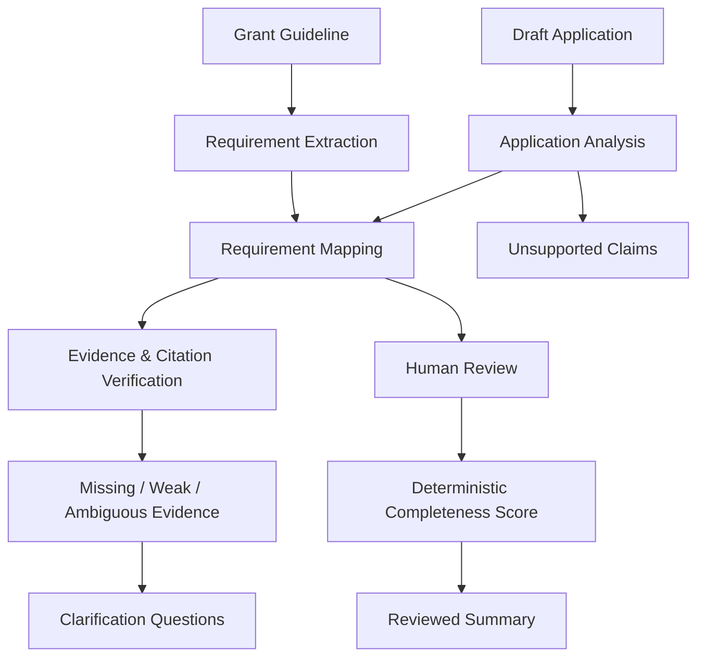

# GrantCheck

## AI-Assisted Funding Application Review Workbench

> **GrantCheck** is an AI-assisted review workbench that evaluates a draft funding application against a supplied grant guideline. It extracts requirements, maps application evidence to those requirements, identifies missing or weak evidence, surfaces unsupported claims, generates clarification questions, and provides a deterministic completeness summary with human review.

---

## Live Demo

* **Frontend**: https://grant-check-ai-funding-application-review-workbench-p1qvvqt6t.vercel.app/
* **Backend API**: https://grantcheck-ai-funding-application-review-puqz.onrender.com/
* **Health Check**: https://grantcheck-ai-funding-application-review-puqz.onrender.com/health

### Recommended Evaluator Flow

1. **Open the frontend** (or local workbench at `http://localhost:5173`).
2. **Create a new assessment** (e.g. *CleanTech Horizon 2026 Review*).
3. **Upload a grant guideline document** (use sample `backend/app/samples/sample_guideline.docx` or `.md`).
4. **Upload a draft funding application** (use sample `backend/app/samples/sample_application.pdf` or `.md`).
5. **Run the AI analysis**: The system executes a controlled multi-stage pipeline extracting requirements, mapping text with source citations, isolating unsupported claims, and formulating clarification questions.
6. **Review requirement/evidence mappings**: Inspect verbatim source citations, page numbers, section references, confidence scores, and AI rationale.
7. **Confirm, correct, or reject AI mappings**: Human reviewers can accept mappings, correct statuses/evidence, or reject unsupported claims with mandatory audit notes.
8. **Review missing supporting documents**: Track required annexes, financial statements, and letters of support.
9. **Open the reviewed completeness summary**: View the real-time recalculated completion score, gap questions, audit snapshot, and regulatory notice.

---

## Problem

Funding and grant applications are notoriously complex. Funding guidelines typically span dozens of pages containing scores of eligibility criteria, mandatory evidentiary stipulations, technical specifications, and formatting recommendations distributed inconsistently throughout the text. Applicants and reviewers struggle to ensure that every explicit requirement is matched with solid, verifiable evidentiary proof in the draft proposal.

Conducting this gap analysis manually is time-consuming, prone to human oversight, and often leads to non-compliant submissions or delayed review cycles. While generative AI can accelerate document parsing and cross-referencing, naive LLM implementations introduce hallucinations, fabricate citations, make arbitrary eligibility decisions, and lack auditable human oversight. The grant review domain demands a controlled, verifiable workbench where AI assists evidence discovery while human reviewers retain full authority over compliance decisions.

---

## Solution

**GrantCheck** bridges this gap by functioning as a high-precision, AI-assisted completeness and evidence-review workbench. It transforms unstructured guidelines and application proposals into an auditable, human-in-the-loop review pipeline:

* **Strict Guideline Deconstruction**: Decomposes guidelines into individual requirements classified by type (`mandatory`, `recommendation`, `eligibility-related`, `submission-related`) and category (`eligibility`, `submission`, `financial`, `technical`, `organisation`, etc.).
* **Verifiable Evidence Mapping**: Cross-references application text against requirements, extracting verbatim excerpts accompanied by document name, page number, and section citation.
* **Evidence Quality Classification**: Classifies mappings into `SUPPORTED`, `WEAK`, `MISSING`, or `AMBIGUOUS`. Any evidence that cannot be found is marked `MISSING` rather than hallucinated.
* **Unsupported Claim Detection**: Flags substantive assertions in the proposal that lack corroborating data in the supplied materials—**without declaring the claims false**.
* **Clarification Question Generation**: Generates targeted questions strictly derived from identified evidence gaps or ambiguities.
* **Supporting Document Checklist**: Tracks mandatory vs. optional supplementary attachments (audited accounts, CVs, partner letters).
* **Human Review Workbench**: Empowers human compliance officers to **Confirm**, **Correct**, or **Reject** AI findings with mandatory reviewer notes and audit timestamps.
* **Deterministic Completeness Scoring**: Calculates completion mathematically based on mandatory requirements; recommendations are tracked separately and never penalize the score.
* **Document Versioning & Stale Detection**: Computes SHA-256 hashes on every upload ($v_1 \to v_2$), prevents duplicate uploads, and marks assessments **STALE** if source materials are modified.
* **Exportable Reviewed Summary**: Consolidates final scores, human overrides, remaining gaps, and immutable raw AI snapshots into an auditable report.

---

## Core Workflow



---

## What Is Genuinely AI-Powered vs. What Is Deterministic & Human

To ensure absolute auditability and prevent hallucinated compliance determinations, GrantCheck maintains a strict boundary between probabilistic AI inference and deterministic business logic:

| Workflow Stage | Mechanism | Engine / Method | Description |
| :--- | :--- | :--- | :--- |
| **Requirement Extraction** | **AI-Powered** | LLM Client (`gemini-2.0-flash` / `gpt-4o-mini` / `MockLLM`) | Parses unstructured guideline text into structured Pydantic requirements with mandatory/recommendation classification and page/section references. |
| **Evidence Retrieval & Mapping** | **AI-Powered** | LLM Client | Evaluates application text against extracted requirements to locate relevant evidence excerpts and assign initial statuses (`SUPPORTED`, `WEAK`, `MISSING`, `AMBIGUOUS`). |
| **Unsupported Claim Detection** | **AI-Powered** | LLM Client | Identifies ambitious project claims (e.g. "reduces energy by 65%") that lack supporting data in the proposal. Reports neutrally that no evidence was found. |
| **Clarification Question Formulation** | **AI-Powered** | LLM Client | Generates precise clarification questions targeting only identified gaps (`MISSING`, `WEAK`, `AMBIGUOUS`). |
| **Citation Verification** | **Deterministic** | `CitationVerifier` (Exact substring search & normalized text matching) | Verifies that AI-quoted evidence exists verbatim in the parsed application text. Hallucinated or non-verbatim quotes are systematically overridden to `MISSING`. |
| **Document Versioning & Stale Detection** | **Deterministic** | SHA-256 Cryptographic Hashing | Generates SHA-256 hashes for all uploaded files. Increments versions ($v_1 \to v_2$), rejects duplicate uploads (`409 Conflict`), and triggers `is_stale = true` when sources change. |
| **Human Decision Overrides** | **Human-in-the-Loop** | Review Workbench UI & API | Reviewer acts as final authority: **Confirm** (accepts AI), **Correct** (overrides status/evidence), or **Reject** (treats as missing). Notes are strictly required for audit trails. |
| **Completeness Scoring** | **Deterministic** | `ScoringService` | Calculates compliance strictly via mathematical formula based on human-reviewed mandatory criteria. AI never scores or decides eligibility. |

---

## Deterministic Completeness Scoring Logic

GrantCheck never permits an LLM to calculate scores, percentages, or compliance ratings. All completion metrics are calculated deterministically by `ScoringService`:

### Status Mapping Matrix
* `SUPPORTED` $\to$ **Complete** (1)
* `WEAK` $\to$ **Incomplete** (0)
* `MISSING` $\to$ **Incomplete** (0)
* `AMBIGUOUS` $\to$ **Incomplete** (0)

### Human Reviewer Overrides
* **CONFIRMED**: Retains AI status (e.g., confirmed `SUPPORTED` remains Complete).
* **CORRECTED**: Uses reviewer-specified override status (e.g., reviewer verifies an offline certificate and corrects `MISSING` to `SUPPORTED`, flipping it to Complete).
* **REJECTED**: Overrides effective status to `MISSING`, regardless of AI classification (flipping it to Incomplete).

### Mandatory vs. Recommendation Isolation
Recommendations are tracked separately as value-add quality indicators. They **never reduce or penalize** the mandatory completion score:

$$\text{Mandatory Completion Percentage} = \left( \frac{\text{Completed Mandatory Requirements}}{\text{Total Mandatory Requirements}} \right) \times 100$$

$$\text{Recommendations Addressed Ratio} = \frac{\text{Addressed Recommendations}}{\text{Total Recommendations}}$$

---

## System Architecture & Data Layer

```text
┌────────────────────────────────────────────────────────────────────────┐
│                        React 18 SPA (Vite + TS)                        │
│  Assessment Setup │ Review Workbench │ Document Tracker │ Summary View │
└────────────────────────────────────┬───────────────────────────────────┘
                                     │ HTTPS / JSON (VITE_API_BASE_URL)
┌────────────────────────────────────▼───────────────────────────────────┐
│                    FastAPI Application Gateway (0.0.0.0:$PORT)         │
│  CORS Middleware │ Request Validation │ Structured Logger (12 Events)  │
├────────────────────────────────────────────────────────────────────────┤
│                           Domain Services                              │
│  Parser (PyMuPDF / python-docx)  │  VersioningService (SHA-256)        │
│  CitationVerifier (Verbatim Test)│  ScoringService (Deterministic Math)│
│  PipelineOrchestrator            │  LLMClient (Structured Pydantic)    │
├────────────────────────────────────────────────────────────────────────┤
│                          Persistence Layer                             │
│  SQLAlchemy 2.0 ORM  │  Alembic Migrations  │  PostgreSQL (Render) /   │
│  Upload Disk Storage (25 MB max)            │  SQLite (Local fallback) │
└────────────────────────────────────────────────────────────────────────┘
```

### Database Entities
* `Assessment`: Root session storing titles, status (`CREATED`, `PARSED`, `ANALYZING`, `ANALYZED`, `ERROR`), active guideline/application version IDs, run numbers, and stale flags (`is_stale`, `stale_reason`).
* `DocumentVersion`: Immutable document version registry storing `doc_type` (`guideline` / `application`), `filename`, `file_hash` (SHA-256), `version_number`, `page_count`, and `upload_timestamp`.
* `Requirement`: Extracted guideline rules with `req_id_code` (e.g. `REQ-001`), `text`, `type` (`mandatory`, `recommendation`, `eligibility-related`, `submission-related`), `category`, and source page/section.
* `RequirementMapping`: Requirement-to-evidence links storing `ai_status`, `confidence`, `evidence`, citations, `reviewer_decision` (`PENDING`, `CONFIRMED`, `CORRECTED`, `REJECTED`), `reviewer_notes`, `reviewed_at`, and `effective_status`.
* `UnsupportedClaim`: Application assertions flagged for lack of substantiation, storing claim text, page number, and reason.
* `ClarificationQuestion`: Targeted inquiries generated for identified gaps, storing question text, gap type, and suggested evidence.
* `SupportingDocument`: Tracked attachments with `is_required`, `is_supplied`, filename, and reviewer notes.

---

## API Reference

### Health & Product Notice
* `GET /health`: Standard container health check returning `{"status": "ok"}`.
* `GET /`: Service metadata, version, and regulatory disclaimer.
* `GET /api/health`: Router-level health check.

### Assessments
* `POST /api/assessments`: Create a new assessment session (`title`, `grant_name`, `application_name`).
* `GET /api/assessments`: List all assessments with completion scores and stale flags.
* `GET /api/assessments/{id}`: Detailed view including documents, score, requirements, and mappings.
* `DELETE /api/assessments/{id}`: Delete an assessment and associated records.
* `POST /api/assessments/{id}/analyze`: Trigger the multi-stage AI analysis pipeline.

### Document Uploads & Versioning
* `POST /api/assessments/{id}/documents/upload`: Upload Guideline or Application document (`multipart/form-data`). Automatically increments version ($v_1 \to v_2$) and flags stale state on content change.
* `GET /api/assessments/{id}/documents`: Retrieve complete document version history and SHA-256 hashes.

### Human Review Workbench
* `POST /api/assessments/{id}/requirements/{req_id}/review`: Submit reviewer decision:
  ```json
  {
    "decision": "CONFIRMED" | "CORRECTED" | "REJECTED",
    "override_status": "SUPPORTED" | "WEAK" | "MISSING" | "AMBIGUOUS",
    "reviewer_notes": "Auditor verified proof in Annex B.",
    "override_evidence": "Optional manual excerpt correction"
  }
  ```

### Supporting Documents
* `GET /api/assessments/{id}/supporting-docs`: List tracked supporting documents.
* `POST /api/assessments/{id}/supporting-docs`: Add a tracked document requirement.
* `PATCH /api/assessments/{id}/supporting-docs/{doc_id}`: Toggle `is_supplied`, attach filename, or save notes.
* `DELETE /api/assessments/{id}/supporting-docs/{doc_id}`: Delete tracked document.

### Reviewed Summary Report
* `GET /api/assessments/{id}/summary`: Returns the comprehensive reviewed completeness report including deterministic score, unsupported claims, clarification questions, reviewer breakdown, immutable raw AI snapshot, and legal notice.

---

## Running Locally

### Prerequisites
* Python 3.11+
* Node.js 18+ and npm
* Docker & Docker Compose (optional for containerized execution)

---

### Option A: Local Evaluation with Docker Compose

A complete containerized stack (PostgreSQL 16, FastAPI backend, React frontend) is defined in [`docker-compose.yml`](file:///d:/FDE_ASSIGNMENTS/GrantCheck-AI-Funding-Application-Review-Workbench/docker-compose.yml):

```bash
# 1. Clone repository
git clone https://github.com/Surendra571/GrantCheck-AI-Funding-Application-Review-Workbench.git
cd GrantCheck-AI-Funding-Application-Review-Workbench

# 2. Create environment configuration
cp .env.example .env

# 3. Build and launch containers
docker compose up --build -d

# 4. Access applications
# Frontend Workbench: http://localhost:3000
# Backend Swagger Docs: http://localhost:8000/docs
# Health Check: http://localhost:8000/health
```

---

### Option B: Running Locally without Docker

#### 1. Backend Setup
```bash
# Navigate to backend directory
cd backend

# Create virtual environment
python -m venv .venv

# Activate virtual environment
# Windows PowerShell:
.\.venv\Scripts\activate
# Linux/macOS:
source .venv/bin/activate

# Install dependencies
pip install -r requirements.txt

# Run database migrations
python -m alembic upgrade head

# Start backend server (port 8000 or 8001 if port conflict)
uvicorn app.main:app --reload --port 8000
```
Backend API interactive OpenAPI documentation will be available at `http://localhost:8000/docs`.

#### 2. Frontend Setup
```bash
# Navigate to frontend directory
cd frontend

# Install dependencies
npm install

# Start Vite development server
npm run dev
```
Frontend will be live at `http://localhost:5173`.

---

## Testing & Quality Verification

The test suite contains **138 automated backend tests** verifying the parsing engine, schema validations, deterministic scoring, reviewer actions, versioning, stale detection, citation verification, unsupported claim rules, API endpoints, structured logging, and an end-to-end user lifecycle.

```bash
# Run full test suite with verbose output
python -m pytest -c backend/pytest.ini backend/tests -v
```

### Test Suite Breakdown (138 Tests)

| Test Module | Test Count | Verifications & Coverage |
| :--- | :---: | :--- |
| `tests/test_scoring.py` | **60** | Exhaustive testing of deterministic scoring matrix; all AI statuses (`SUPPORTED`, `WEAK`, `MISSING`, `AMBIGUOUS`); reviewer overrides (`CONFIRMED`, `CORRECTED`, `REJECTED`); isolation of recommendations; rounding and edge cases. |
| `tests/test_api_endpoints.py` | **18** | REST endpoint lifecycles; file upload validations (size limit, file formats, empty files); review actions (mandating reviewer notes); supporting documents CRUD; error handling (400, 404, 409, 413, 415, 422). |
| `tests/test_versioning_and_stale.py` | **13** | SHA-256 hash calculations; sequential version increments ($v_1 \to v_2$); duplicate upload prevention; automatic stale flagging when guideline, application, or both change; re-analysis branching. |
| `tests/test_pipeline_and_validation.py` | **12** | Multi-step pipeline execution; verbatim quote validation; override of hallucinated or missing citations to `MISSING`; non-judgmental unsupported claim classification; malformed LLM response handling. |
| `tests/test_schemas.py` | **12** | Pydantic v2 schema validations for requirements, mappings, evidence types, review actions, and summary structures. |
| `tests/test_ai_services.py` | **11** | Requirement extraction logic; evidence retriever; mock LLM determinism; retry handling on transient network failures; provider error sanitization. |
| `tests/test_parser.py` | **8** | PyMuPDF page-by-page PDF extraction; `python-docx` section parsing; plain text handling; empty file rejection; unsupported file format guards. |
| `tests/test_logging.py` | **3** | Structured JSON logging validation across 12 lifecycle events; automated sanitization of sensitive API keys and tokens (`sanitize_data`). |
| `tests/test_e2e_workflow.py` | **1** | Full end-to-end integration flow: $\text{Create} \to \text{Upload} \to \text{AI Analyze} \to \text{Review Overrides} \to \text{Score} \to \text{Summary} \to \text{Stale Re-analysis}$. |

---

## Production Cloud Deployment (Render & Vercel)

The codebase is configured for cloud deployment across Render, Vercel, and GitHub:

### Backend & Database on Render
* **Infrastructure Blueprint**: [`render.yaml`](file:///d:/FDE_ASSIGNMENTS/GrantCheck-AI-Funding-Application-Review-Workbench/render.yaml) defines the managed PostgreSQL database (`grantcheck-db`) and Python Web Service (`grantcheck-api`).
* **Root Container Support**: [`Dockerfile`](file:///d:/FDE_ASSIGNMENTS/GrantCheck-AI-Funding-Application-Review-Workbench/Dockerfile) and [`.dockerignore`](file:///d:/FDE_ASSIGNMENTS/GrantCheck-AI-Funding-Application-Review-Workbench/.dockerignore) in the repository root allow automated Render container deployment with dynamic port binding (`${PORT:-8000}`) and automatic Alembic migrations on startup.
* **CORS Support**: Configured dynamically in [`backend/app/main.py`](file:///d:/FDE_ASSIGNMENTS/GrantCheck-AI-Funding-Application-Review-Workbench/backend/app/main.py) with regex matching all Vercel deployment URLs (`r"^https:\/\/.*\.vercel\.app$"`).

### Frontend on Vercel
* **Live Deployment**: https://grant-check-ai-funding-application-review-workbench-p1qvvqt6t.vercel.app/
* **SPA Routing**: Configured in [`frontend/vercel.json`](file:///d:/FDE_ASSIGNMENTS/GrantCheck-AI-Funding-Application-Review-Workbench/frontend/vercel.json) to rewrite all routes to `/index.html`.
* **Dynamic Backend Binding**: [`frontend/src/api/client.ts`](file:///d:/FDE_ASSIGNMENTS/GrantCheck-AI-Funding-Application-Review-Workbench/frontend/src/api/client.ts) detects `VITE_API_BASE_URL` with seamless fallback to `/api` for local proxying.

---

## Benchmark Sample Files

Pre-packaged sample documents are provided in `backend/app/samples/` for immediate benchmark evaluation:
* `sample_guideline.docx` & `sample_guideline.md`: UK CleanTech Horizon Grant 2026 Guidelines (eligibility criteria, financial stipulations, carbon reduction metrics, letters of support).
* `sample_application.pdf` & `sample_application.md`: EcoFilter Advanced Membrane Proposal draft.
* `sample_guideline_v2.md`: Amended Guideline v2 (used to demonstrate version incrementing and stale assessment detection).
* `generate_sample_binaries.py`: Utility script to regenerate sample PDF and DOCX files.

---

## What Was Intentionally Excluded

To maintain strict alignment with the product vision and prevent scope bloat, the following capabilities were deliberately excluded:
1. **Autonomous Agents**: No autonomous agent with tool execution or open-ended web browsing is permitted. The pipeline is strictly controlled and multi-staged.
2. **Automated Funding Decisions**: The system never outputs an authoritative legal, regulatory, or funding-eligibility decision.
3. **Subjective Writing Scoring**: The system does not grade applicant tone, prose style, or persuasive quality; it evaluates objective evidentiary presence against guidelines.
4. **Automatic Text Rewriting**: The system does not draft proposal content on behalf of the applicant to preserve application authenticity.
5. **Hallucinated Citations**: The AI is never allowed to fabricate page numbers or sections; unverified quotes are automatically overridden to `MISSING`.

---

## Remaining Limitations

* **OCR for Scanned Images**: The current document parser processes text-based PDFs (PyMuPDF) and Word documents (python-docx). Non-OCR scanned bitmaps require pre-processing before upload.
* **Complex Multi-Table Cross-Referencing**: While structured text in tables is extracted, complex multi-page financial ledger spreadsheets (`.xlsx`) are best represented via supporting document metadata rather than raw inline extraction.
* **Ephemeral Uploads on Free Cloud Tiers**: In ephemeral container environments without persistent block storage, uploaded binary files reside in temporary container storage. However, all extracted requirements, mappings, citations, and reviewer decisions are permanently persisted in PostgreSQL.

---

## Responsible AI & Regulatory Disclaimer

> **IMPORTANT REGULATORY & PRODUCT NOTICE**  
> **GrantCheck is an AI-assisted completeness and evidence-review tool.**  
> It does **NOT** make an authoritative legal, regulatory, or funding-eligibility decision. The final decision remains strictly the responsibility of human reviewers, grant administrators, and funding authorities.

* **Neutral Unsupported Claim Reporting**: When the system detects an uncorroborated claim in the application, it never declares that the claim is false. It strictly records: *"No supporting evidence found in supplied materials"*.
* **No Invented Evidence**: If evidence cannot be found in the supplied materials, the system outputs `MISSING` rather than guessing.
* **Evidence-Based Rationale**: AI reasoning is kept concise, objective, and anchored directly to cited excerpts.
* **Audit Trail Preservation**: Reviewer actions never overwrite or erase original AI findings; both the AI suggestion and the human decision are preserved with timestamps.
