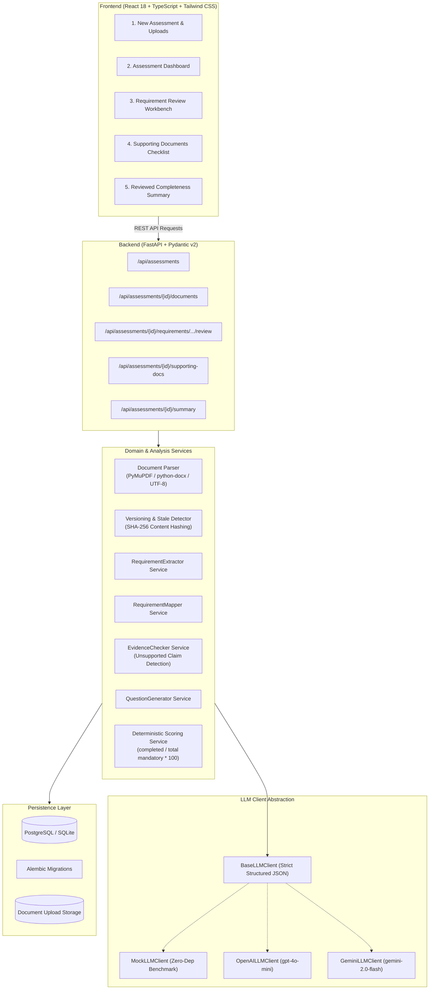

# GrantCheck — AI Funding Application Review Workbench

> **IMPORTANT REGULATORY & PRODUCT NOTICE**  
> **GrantCheck is an AI-assisted completeness and evidence-review tool.**  
> It does **NOT** make an authoritative legal, regulatory, or funding-eligibility decision. The final decision remains strictly the responsibility of human reviewers, grant administrators, and funding authorities.

---

## 1. Overview & Architecture

**GrantCheck** reviews a draft funding application against a supplied grant/funding guideline document. It decomposes guidelines into structured requirements, maps application evidence with exact citations, identifies unsupported assertions, formulates targeted clarification questions, tracks supporting attachments, detects stale states upon document modification, and calculates checklist completion **deterministically**.

### System Architecture



---

## 2. Core User Workflow

1. **Create Assessment**: Initiates a review session with grant scheme and proposal metadata.
2. **Upload Guideline**: Uploads official grant documentation (`.pdf`, `.docx`, `.txt`, `.md`).
3. **Upload Application**: Uploads applicant proposal document (`.pdf`, `.docx`, `.txt`, `.md`).
4. **Supporting Documents Metadata**: Tracks mandatory vs optional attachments (audited accounts, IP certificate, etc.).
5. **Document Parsing & Hashing**: Computes SHA-256 hash, extracts page-by-page text using PyMuPDF and python-docx.
6. **Requirement Extraction**: AI extracts structured requirements classified as `mandatory`, `recommendation`, `eligibility-related`, or `submission-related`, alongside categories (`eligibility`, `submission`, `documentation`, `project`, `financial`, `organisation`, `recommendation`, `other`).
7. **Evidence Mapping**: Maps each requirement to verbatim application text with document, page, section, and confidence score.
8. **Unsupported Claim Detection**: Flags substantive application assertions lacking verifiable evidence in the materials (**without declaring the claim false**).
9. **Clarification Question Generation**: Produces actionable questions for missing items and ambiguous metrics.
10. **Human Review Actions**: Reviewer can **Confirm**, **Correct** (override effective status), or **Reject** (treats requirement as missing) and add reviewer audit notes.
11. **Deterministic Scoring**: Backend calculates `completed mandatory / total mandatory * 100`. Recommendations do not reduce mandatory completion.
12. **Versioning & Stale Detection**: If a replaced document content hash changes, the assessment is automatically marked **STALE** requiring re-analysis.
13. **Reviewed Summary Report**: Generates an exportable, printable audit summary report.

---

## 3. Deterministic Scoring Logic

Scoring is strictly calculated by `ScoringService` in the backend—**never by the LLM**.

* **For Mandatory Requirements**:
  * `SUPPORTED` = Complete (1)
  * `WEAK` = Incomplete (0)
  * `MISSING` = Incomplete (0)
  * `AMBIGUOUS` = Incomplete (0)
* **Reviewer Overrides**:
  * `CONFIRMED`: Retains AI status (or confirmed status).
  * `CORRECTED`: Uses `reviewer_override_status` (e.g. reviewer marks WEAK as SUPPORTED after manual verification).
  * `REJECTED`: Overrides effective status to `MISSING` / incomplete.
* **Recommendations**: Tracked separately and **do not reduce** mandatory completion percentage:
  $$\text{Completion Percentage} = \frac{\text{Completed Mandatory Requirements}}{\text{Total Mandatory Requirements}} \times 100$$

---

## 4. Source Document Versioning & Stale Detection

Every uploaded document is tracked with:
* Sequential version number ($v_1, v_2, \dots$)
* SHA-256 content hash
* Timestamp & archive on disk

When a document is replaced:
1. Previous version is archived and marked `is_active = False`.
2. Content hash is compared against the active version:
   * If identical, duplicate upload error is raised (`409 Conflict`).
   * If content differs, new version ($v_{n+1}$) is registered with `is_active = True`.
3. The assessment is flagged `is_stale = True` with a clear explanation:
   > *"Assessment stale — source document changed. Guideline was updated from v1 to v2. Re-analysis is required."*
4. The UI prominently displays a banner with a 1-click **Re-analyze Application** action.

---

## 5. API Reference

### Health & Product Notice
* `GET /`: Health check, application version, and product regulatory disclaimer.

### Assessments
* `POST /api/assessments`: Create a new assessment session.
* `GET /api/assessments`: List all assessments with completion score and stale flags.
* `GET /api/assessments/{id}`: Full assessment detail with documents, score, requirements, and mappings.
* `DELETE /api/assessments/{id}`: Delete an assessment and associated records.
* `POST /api/assessments/{id}/analyze`: Execute the multi-stage AI analysis pipeline.

### Document Uploads & Versioning
* `POST /api/assessments/{id}/documents/upload`: Upload Guideline or Application document (`multipart/form-data`). Automatically increments version and triggers stale detection if content changes.
* `GET /api/assessments/{id}/documents`: Retrieve version history and content hashes.

### Human Review Workbench
* `POST /api/assessments/{id}/requirements/{req_id}/review`:
  ```json
  {
    "decision": "CONFIRMED" | "CORRECTED" | "REJECTED",
    "override_status": "SUPPORTED" | "WEAK" | "MISSING" | "AMBIGUOUS",
    "reviewer_notes": "Reviewed audit certificate, verified.",
    "override_evidence": "Optional manual excerpt correction"
  }
  ```

### Supporting Documents
* `GET /api/assessments/{id}/supporting-docs`: List tracked supporting documents.
* `POST /api/assessments/{id}/supporting-docs`: Add new supporting document requirement.
* `PATCH /api/assessments/{id}/supporting-docs/{doc_id}`: Toggle `is_supplied`, attach filename, or save notes.
* `DELETE /api/assessments/{id}/supporting-docs/{doc_id}`: Remove tracked document.

### Completeness Summary Report
* `GET /api/assessments/{id}/summary`: Generates reviewed completeness report with deterministic score, unsupported claims, missing documents, clarification questions, and legal notice.

### Public Production Health Endpoints
* `GET /health`: Standard health check returning `{"status": "ok"}` for Render, load balancers, and monitoring.
* `GET /`: Service metadata, version info, and regulatory disclaimer.
* `GET /api/health`: API route health check.

---

## 6. Public Production Cloud Deployment (Render & Vercel)

The system is configured for continuous production deployment using **GitHub**, **Render** (FastAPI backend + PostgreSQL), and **Vercel** (React SPA frontend).

### Production Architecture
```text
GitHub (Surendra571/GrantCheck-AI-Funding-Application-Review-Workbench)
   │
   ├─► Vercel (Frontend SPA: React + Vite + TypeScript)
   │     │ (communicates over HTTPS via VITE_API_BASE_URL)
   │     ▼
   └─► Render Web Service (Backend: FastAPI + Uvicorn + Python 3.12)
         │ (runs on 0.0.0.0:$PORT with Alembic migrations)
         ▼
       Render Managed PostgreSQL (Database: grantcheck-db)
         │
         ▼
       Configured AI Provider (Server-side: Mock / Gemini / OpenAI)
```

### 1. Backend & Database Deployment on Render

A zero-touch Infrastructure-as-Code Blueprint (`render.yaml`) is included in the root directory:

1. Log in to [Render Dashboard](https://dashboard.render.com).
2. Go to **Blueprints** → **New Blueprint Instance**.
3. Connect repository: `https://github.com/Surendra571/GrantCheck-AI-Funding-Application-Review-Workbench`.
4. Render will automatically detect `render.yaml` and provision:
   - **`grantcheck-db`**: Free managed PostgreSQL database.
   - **`grantcheck-api`**: Python Web Service running in `backend` directory.
   - Build Command: `pip install -r requirements.txt`
   - Start Command: `python -m alembic upgrade head && uvicorn app.main:app --host 0.0.0.0 --port $PORT`
   - Health Check Path: `/health`
5. Set backend environment variables on Render:
   - `LLM_PROVIDER`: `mock` (or `gemini` / `openai` with corresponding server-side API key)
   - `FRONTEND_URL`: URL of the deployed Vercel frontend (e.g. `https://grantcheck-workbench.vercel.app`)

### 2. Frontend Deployment on Vercel

1. Log in to [Vercel](https://vercel.com).
2. Click **Add New...** → **Project** and select `Surendra571/GrantCheck-AI-Funding-Application-Review-Workbench`.
3. Configure project settings:
   - **Framework Preset**: `Vite`
   - **Root Directory**: `frontend`
   - **Build Command**: `npm run build`
   - **Output Directory**: `dist`
4. Add Environment Variable:
   - `VITE_API_BASE_URL`: `https://<your-render-backend-url>.onrender.com`
5. Click **Deploy**. Vercel will build and publish the frontend with SPA client routing handled by `frontend/vercel.json`.

---

## 7. Local Setup & Running

### Prerequisites
* Python 3.11+
* Node.js 18+ and npm
* Docker & Docker Compose (optional for containerized deployment)

### Option A: Local Evaluation with Docker Compose

This Compose stack is a local evaluation setup, not a public production deployment: the API has no authentication or authorization, and Compose intentionally publishes services only on loopback. Do not expose these ports directly to an untrusted network. A public deployment needs an authenticated access layer, TLS termination, and operational controls for secrets, backups, and monitoring.

```bash
# 1. Clone or navigate to the project directory
cd GrantCheck-AI-Funding-Application-Review-Workbench

# 2. Create local Compose settings and replace the placeholder password
cp .env.example .env

# 3. Build and start containers (PostgreSQL, Backend, Frontend)
docker compose up --build -d

# 4. Access the applications
# Frontend Review Workbench: http://localhost:3000
# Backend API & Swagger Docs: http://localhost:8000/docs
```

Compose binds published ports to `127.0.0.1`. Set `FRONTEND_HOST_PORT`, `BACKEND_HOST_PORT`, or `POSTGRES_HOST_PORT` in `.env` if those local ports are already in use. On first startup, the backend applies Alembic migrations before serving requests. The default provider is the deterministic mock; configure `LLM_PROVIDER` and the corresponding API key in `.env` to use a hosted provider. Keep `.env` private and do not commit it.

To stop containers:
```bash
docker compose down
```

---

### Option B: Running Locally without Docker

#### 1. Backend Setup
```bash
# Navigate to backend directory
cd backend

# Optional local settings (default SQLite and mock provider work without this)
# Copy the project template and adjust DATABASE_URL/LLM settings as needed:
# Windows PowerShell: Copy-Item ..\.env.example .env
# Linux/macOS: cp ../.env.example .env

# Create virtual environment
python -m venv .venv

# Activate virtual environment
# Windows:
.venv\Scripts\activate
# Linux/macOS:
source .venv/bin/activate

# Install dependencies
pip install -r requirements.txt

# Run database migrations
python -m alembic upgrade head

# Start backend server
uvicorn app.main:app --reload --port 8000
```
Backend API will be live at `http://localhost:8000`. Interactive OpenAPI documentation is available at `http://localhost:8000/docs`.

#### 2. Frontend Setup
```bash
# Navigate to frontend directory
cd frontend

# Install dependencies
npm install

# Start Vite development server
npm run dev
```
Frontend will be live at `http://localhost:5173`.

---

## 7. Running the Test Suite

The test suite covers document parsing (PDF, DOCX, TXT), schema validations, deterministic scoring, reviewer actions, versioning, stale detection, unsupported claim rules, API routes, and a complete end-to-end user workflow.

```bash
# Windows PowerShell, from the project root
backend\.venv\Scripts\python.exe -m pytest backend\tests -v

# Linux/macOS, from the project root (after creating/activating backend/.venv)
backend/.venv/bin/python -m pytest backend/tests -v

# Or from backend directory:
cd backend
python -m pytest tests -v
```

### Test Coverage Highlights
* `test_parser.py`: PDF page extraction (PyMuPDF), DOCX parsing, text parsing, empty files, unsupported file formats, hash determinism.
* `test_schemas.py`: Pydantic model validation for requirements, mappings, unsupported claims, clarification questions.
* `test_scoring.py`: Deterministic scoring rules, mandatory vs recommendation isolation, reviewer confirmation/correction/rejection overrides, edge cases.
* `test_versioning_and_stale.py`: Version numbering ($v_1 \to v_2$), SHA-256 hash comparison, duplicate upload prevention, stale flagging on source modification.
* `test_ai_services.py` and `test_pipeline_and_validation.py`: Requirement extraction, evidence mapping, citation validation (including blank and fabricated evidence), unsupported claims (**never declared false**), malformed LLM responses, safe provider error logging, and clarification questions.
* `test_api_endpoints.py`: Assessment lifecycle, file upload type/empty/size/duplicate handling, review actions, supporting docs CRUD, and HTTP errors (400, 404, 409, 413, 415, 422).
* `test_e2e_workflow.py`: Complete lifecycle covering:
  $$\text{Create} \to \text{Upload Guideline \& Application} \to \text{AI Analysis} \to \text{Confirm/Correct/Reject} \to \text{Deterministic Score} \to \text{Summary} \to \text{Update/Stale/Re-analyze}$$

---

## 8. Sample Benchmark Files

Pre-built sample documents are provided in `backend/app/samples/`:
1. `sample_guideline.docx` & `sample_guideline.md`: UK CleanTech Horizon Grant 2026 Guidelines (eligibility, audited accounts, KPIs, risk matrix, recommendations).
2. `sample_application.pdf` & `sample_application.md`: EcoFilter Advanced Membrane Water Reclamation System proposal draft.
3. `sample_guideline_v2.md`: Amended Guideline v2 (used to trigger version increment and stale detection).
4. `generate_sample_binaries.py`: Utility script to regenerate sample PDF and DOCX binaries.

To generate or refresh sample binaries:
```bash
backend/.venv/Scripts/python.exe backend/app/samples/generate_sample_binaries.py
```

---

## 9. Regulatory & Legal Disclaimer Notice

**GrantCheck is an AI-assisted completeness and evidence-review tool.**  
It does **NOT** make an authoritative legal, regulatory, or funding-eligibility decision. The application facilitates human compliance review by mapping evidentiary claims against funding guidelines, detecting documentary gaps, and verifying completeness. All funding determinations must be made by qualified human reviewers and authorized funding decision-makers.
